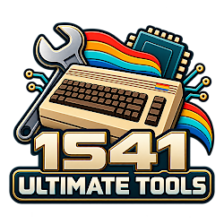

# 1541ultimate-tools



Build, deploy and debug tooling for the [1541 Ultimate](https://github.com/GideonZ/1541ultimate)
firmware.

[](https://github.com/chrisgleissner/1541ultimate-tools/actions/workflows/test.yml)
[](https://codecov.io/gh/chrisgleissner/1541ultimate-tools)
[](https://github.com/chrisgleissner/1541ultimate-tools/releases)
[](https://github.com/GideonZ/1541ultimate)
[](https://github.com/chrisgleissner/1541ultimate-tools)

These tools are not part of the firmware repository. You install them into a checkout
of it, and they stay out of git there.

- [Quick start](#quick-start)
- [What you get](#what-you-get)
- [Install](#install)
- [Prerequisites](#prerequisites)
- [Build firmware](#build-firmware)
- [Run and deploy on a device](#run-and-deploy-on-a-device)
- [Device settings](#device-settings)
- [Troubleshooting](#troubleshooting)
- [Documentation](#documentation)
- [Development](#development)

## Quick start

You need git, Docker and a 1541ultimate checkout. If you have no checkout yet:

```bash
git clone https://github.com/GideonZ/1541ultimate.git
```

Install release 0.1.0 into it. Set `ULTIMATE` to your checkout:

```bash
VERSION=0.1.0
ULTIMATE="$HOME/1541ultimate"
TMP="$(mktemp -d)"
curl -fsSL "https://github.com/chrisgleissner/1541ultimate-tools/archive/refs/tags/v${VERSION}.tar.gz" | tar -xz -C "$TMP"
"$TMP/1541ultimate-tools-${VERSION}/install.sh" "$ULTIMATE"
rm -rf "$TMP"
```

Build the C64 Ultimate / Ultimate 64 Elite II firmware:

```bash
cd "$ULTIMATE"
./build-tool --check-support      # what this machine can build
./build-tool u64ii                # writes update_<commit>.ue2
```

## What you get

| Command | What it does | Details |
|---|---|---|
| `./build-tool` | Builds any firmware target inside Docker, and optionally deploys it over FTP or JTAG | [Build firmware](#build-firmware) |
| `./build` | Runs the full sweep: clean, host unit tests, build, deploy, the remaining targets | [Build firmware](#build-firmware) |
| `tooling/build_and_deploy_u64.sh` | Runs a built Ultimate 64 application from RAM over JTAG, in about 30 s | [docs/u64-jtag-deploy.md](docs/u64-jtag-deploy.md) |
| `tooling/flash_u64.py` | Flashes an Ultimate 64 Elite with nobody at the keyboard | [docs/u64-unattended-flash.md](docs/u64-unattended-flash.md) |
| `tooling/u64ii_jtag.sh` | C64 Ultimate / Ultimate 64 Elite II over JTAG (FT232H or USB-Blaster): run an FPGA image and application from RAM, read the console and memory | [docs/c64u-jtag.md](docs/c64u-jtag.md) |
| `tooling/u64ii_gdb.sh` | gdb for the running C64 Ultimate application: tasks as threads, backtraces | [docs/c64u-jtag.md](docs/c64u-jtag.md) |
| `tooling/c64u_monitor.py` | Watches a C64 Ultimate's video stream, REST API and console | [docs/c64u-jtag.md](docs/c64u-jtag.md) |
| `tooling/apply_pr.sh` | Makes a throwaway worktree with upstream pull requests applied | `./build-tool --help` |
| `vivado/install.sh` | Installs AMD Vivado 2024.1 for Artix-7 without interaction | [docs/vivado-install.md](docs/vivado-install.md) |

`vivado/` and `patches/` are used from this repository; the installer does not copy them.

## Install

### Apply a release to an existing checkout

Pick a release from the [releases page](https://github.com/chrisgleissner/1541ultimate-tools/releases),
then run these commands. Only the first two lines change:

```bash
VERSION=0.1.0                        # the release to apply
ULTIMATE="$HOME/1541ultimate"        # your 1541ultimate checkout
TMP="$(mktemp -d)"
curl -fsSL "https://github.com/chrisgleissner/1541ultimate-tools/archive/refs/tags/v${VERSION}.tar.gz" | tar -xz -C "$TMP"
"$TMP/1541ultimate-tools-${VERSION}/install.sh" "$ULTIMATE"
rm -rf "$TMP"
```

Check which release a checkout has:

```bash
cat "$ULTIMATE/.1541ultimate-tools-version"
```

To move to another release, run the same commands with a different `VERSION`. Add
`--dry-run` before the checkout path to see what the installer would do first.

### Install the latest development version

```bash
git clone https://github.com/GideonZ/1541ultimate.git
git clone https://github.com/chrisgleissner/1541ultimate-tools.git
1541ultimate-tools/install.sh 1541ultimate
```

To update, `git -C 1541ultimate-tools pull` and run `install.sh` again.

### What the installer changes

`install.sh CHECKOUT`:

- **Copies the tools:** `build`, `build.cmd`, `build-tool`, `build-tool.d/`,
  `.build-tool.env.example` and the tools in `tooling/` into the checkout, and makes
  the scripts executable.
- **Does not copy anything else:** not this README, `docs/`, the logo, the tests,
  `vivado/` or `patches/`.
- **Records the version** in `.1541ultimate-tools-version`.
- **Hides the tools from git:** it lists each installed path in the checkout's
  `.git/info/exclude`. That file is local to the checkout and never committed, so
  `git status` stays clean and no tool file can reach an upstream commit by accident.
- **Leaves everything else alone:**
  - It overwrites files from an earlier install, and leaves your own files in
    `tooling/` alone.
  - It never changes a tracked file.
  - A second run adds no duplicate entries.
  - It works in git worktrees.

It refuses a directory that is not a git checkout with the 1541ultimate layout
(`software/` and `target/`).

## Prerequisites

| Requirement | Needed for |
|---|---|
| Docker | Every RISC-V target (`u2`, `u2pl`, `u64ii`) |
| Quartus and Nios II EDS, on the host | The Nios II targets (`u64`, `u2plus`); the Docker image has no Nios toolchain |
| USB-Blaster | Ultimate 64 JTAG deploy and monitoring; optionally the C64 Ultimate JTAG tools |
| FT232H (for example Adafruit) and Python 3 | C64 Ultimate / Ultimate 64 Elite II JTAG; pyftdi is installed into a virtual environment on first use |
| Lattice Diamond | Full `u2pl` FPGA synthesis only (see [Troubleshooting](#troubleshooting)) |

`build-tool` prepares a Docker image `1541u-build:latest` from
`ghcr.io/gideonz/riscv:latest` the first time it runs.

## Build firmware

| Target | Output | Toolchain | Aliases |
|---|---|---|---|
| `u2` | `update.u2r` | RISC-V + Xilinx ISE (software only: cached FPGA) | |
| `u2plus` | `update.u2p` | Nios II + Quartus (software only: cached FPGA) | |
| `u2pl` | `update.u2l` | RISC-V + Lattice Diamond + ESP32-C3 | `u2l` |
| `u64` | `update.u64` | Nios II + Quartus + ESP32 | |
| `u64ii` | `update.ue2` | RISC-V + ESP32-S3; FPGA images from `external/` | `ue2`, `c64u` |

The C64 Ultimate is Ultimate 64 Elite II hardware and uses the `u64ii` target.

```bash
./build-tool --check-support    # which targets this machine can build
./build-tool --list-targets     # every target and its toolchain
./build-tool u64ii              # one target
./build-tool u64ii u64          # several targets
./build-tool -s u2pl            # software only, with a cached FPGA bitstream
./build-tool --parallel         # the default set (u64, u64ii, u2), concurrently
```

`./build` runs the full sweep. It cleans first, runs the host unit tests, builds,
deploys, and checks each artifact's size. It takes no target, and it is slower than
`build-tool`, so use it for a full check rather than for iteration:

```bash
./build                  # u64 -> JTAG -> FTP -> u64ii -> u2
./build --parallel       # u64 and u64ii concurrently, u2 last
```

`BUILD_TOOL_ALLOW_PARTIAL=1` lets a run with several targets continue past one that
fails.

## Run and deploy on a device

### Ultimate 64 over JTAG

```bash
./build-tool --jtag u64                     # build, then run from RAM
./build-tool u64                            # or: build ...
bash tooling/build_and_deploy_u64.sh        # ... then run the built ELF (about 30 s)
```

The deploy script takes no arguments and runs
`target/u64/nios2/ultimate/result/ultimate.elf`, so build first. If the Intel FPGA
tools are not found, set `INTEL_FPGA_ROOT`:

```bash
INTEL_FPGA_ROOT=/opt/intelFPGA_lite/19.1 bash tooling/build_and_deploy_u64.sh
```

Nothing is written to flash; a power cycle returns to the flashed firmware. To flash
an Ultimate 64 Elite without anyone at the keyboard, see
[docs/u64-unattended-flash.md](docs/u64-unattended-flash.md).

### C64 Ultimate and Ultimate 64 Elite II over JTAG

Wire an FT232H or a USB-Blaster to the JTAG header first, as described in
[docs/c64u-jtag.md](docs/c64u-jtag.md). Then:

```bash
tooling/u64ii_jtag.sh probe                  # identify the board; changes nothing
./build-tool --jtag c64u                     # build ultimate.bin and run it from RAM
./build-tool --jtag c64u --jtag-fpga warm    # keep the FPGA image, restart only the CPU
./build-tool --jtag-monitor c64u             # show the application's console
```

### Try an upstream pull request

`build-tool` applies the pull request in a throwaway worktree, so your checkout stays
as it is:

```bash
./build-tool --apply-pr 705 --pr-base upstream/master --jtag c64u
```

### Build another firmware tree

Another tree with the same layout, for example a C64 Ultimate firmware tree:

```bash
./build-tool --repo-dir ../other-tree c64u
```

## Device settings

Deploy and verification steps read the device from the environment, or from
`.build-tool.env` in the checkout (copy `.build-tool.env.example`). A step whose
setting is missing is skipped, not failed.

| Variable | Used by | When unset |
|---|---|---|
| `DEPLOY_HOST` | `build`, FTP deploy | The step is skipped and reported as `SKIPPED` |
| `DEPLOY_PATH` | `build`, FTP deploy | `/Usb1/firmware/u64/custom` |
| `U64_VERIFY_HOST` | REST check after a u64 deploy | Skipped with a warning |
| `U64II_VERIFY_HOST` | REST check after a u64ii deploy | Skipped with a warning |
| `U64II_JTAG_URL` | C64 Ultimate JTAG cable: an FT232H URL, or `blaster` | `ftdi://ftdi:232h/1` |
| `INTEL_FPGA_ROOT` | Ultimate 64 JTAG deploy and monitor | Searched under `~/intelFPGA_lite`, `~/altera_lite`, `/opt/...` |

```bash
export DEPLOY_HOST=my-u64            # hostname or IP
export U64_VERIFY_HOST=my-u64
./build
```

Or per invocation:

```bash
./build-tool --deploy-only -d u64 --deploy-host my-u64
./build-tool u64ii -d u64ii --deploy-host 192.168.1.64 --verify-host 192.168.1.64
```

There are no credentials to set. The Ultimate's FTP server accepts anonymous logins.

## Troubleshooting

### `u2pl` fails at the FPGA step

The full `u2pl` target runs Lattice Diamond (`diamondc`), which is proprietary and is
in no build image. Build software only with `-s` instead. That embeds an existing
ECP5 bitstream, which you take from an upstream CI artifact:

```bash
gh run download <RUN_ID> --repo GideonZ/1541ultimate \
    -n factory_package_u2pl_<version> -D /tmp/u2pl
cp /tmp/u2pl/target/fpga/u2plus_ecp5/impl1/u2p_ecp5_impl1.bit \
   target/fpga/u2plus_ecp5/impl1/
./build-tool -s u2pl
```

Without the bitstream the build fails late, in the updater step, with
`No rule to make target '.../u2p_ecp5_impl1.bit'`.

### A RISC-V build fails

Upstream CI builds the RISC-V targets on a self-hosted runner whose image differs
from `ghcr.io/gideonz/riscv:latest`. The image `build-tool` prepares builds `u64ii`
from upstream master; CI checks this every night. Before you treat a failure as a
regression, build the same target from a clean checkout and compare.

To use the exact toolchain upstream CI uses:
1. Place a `riscv32-unknown-elf` GCC 10.2.0 at `riscv/` inside a build tools
   directory, so that `<dir>/riscv/bin/riscv32-unknown-elf-g++` exists.
2. Pass that directory with `--build-tools-dir <dir>`.

`build-tool` then puts it ahead of the image's toolchain for `u2`, `u2pl` and `u64ii`.
It stops if the version or checksum is not the pinned CI build.

### No ESP-IDF

The full `u64` and `u64ii` targets build ESP32 firmware too. Without an ESP-IDF
installation, use the upstream make targets that skip it. Both still produce the
application binary the deploy steps need:

```bash
make u64_no_esp
make u64ii_no_esp
```

### `make u64_swapply`

`patches/0001-add-u64_swapply-make-target.patch` adds a `u64_swapply` make target,
which builds the Ultimate 64 application and runs it over JTAG in one step. It
changes the tracked `Makefile`, so revert it before you push a branch upstream:

```bash
git -C "$ULTIMATE" apply "$PWD/patches/0001-add-u64_swapply-make-target.patch"   # from this repository
make -C "$ULTIMATE" u64_swapply
git -C "$ULTIMATE" checkout Makefile                                               # when done
```

## Documentation

- [docs/c64u-jtag.md](docs/c64u-jtag.md): JTAG on the C64 Ultimate and Ultimate 64
  Elite II. Covers wiring, commands, gdb, recovery and pull requests.
- [docs/u64-jtag-deploy.md](docs/u64-jtag-deploy.md): what the Ultimate 64 JTAG deploy
  does, and what it deliberately does not do.
- [docs/u64-unattended-flash.md](docs/u64-unattended-flash.md): flashing an Ultimate
  64 Elite unattended.
- [docs/vivado-install.md](docs/vivado-install.md): the unattended Vivado install.

## Development

### Tests

The host tests need only Python 3, git and bash. The cables, the FPGA and the device
are simulated, so no hardware is needed:

```bash
python3 -m unittest discover -s tooling -p 'test_*.py'
python3 -m unittest discover -s vivado -p 'test_*.py'
python3 -m unittest discover -s tests -p 'test_install.py'
bash tooling/test_apply_pr.sh
```

With pyftdi installed, one more test checks the MPSSE opcodes against pyftdi's own
table.

To measure coverage with the settings in `.coveragerc`:

```bash
python3 -m coverage run -m unittest discover -s tooling -p 'test_*.py'
python3 -m coverage run -m unittest discover -s vivado -p 'test_*.py'
python3 -m coverage combine && python3 -m coverage report
```

`tests/upstream/` checks the tools against a real 1541ultimate checkout:
- **Firmware facts:** the constants the tools carry, such as user chain registers,
  bitstreams, boot magic, cache size and FreeRTOS trap frame, against the firmware
  sources.
- **Installation:** this README's development install, run as written.
- **A built application:** after `build-tool u64ii`, the gdb server's FreeRTOS
  offsets against the ELF's debug information, and the unwinder against its
  disassembly. This needs a RISC-V objdump, such as `riscv64-unknown-elf-objdump`
  from the `binutils-riscv64-unknown-elf` package.

```bash
ULTIMATE_REPO_DIR=../1541ultimate python3 -m unittest discover -s tests/upstream -p 'test_*.py'
```

Without `ULTIMATE_REPO_DIR`, or without a `u64ii` build, those tests are skipped.

### Continuous integration

`.github/workflows/test.yml` runs on every push to `main`, on every pull request, and
every night:

- **`host-tests`:**
  - Runs every host test under coverage, fails below 98%, and publishes the result
    to Codecov.
  - Also runs the `apply_pr.sh` and installer tests, and a `bash -n` check of every
    shell script.
- **`upstream`:** clones GideonZ/1541ultimate, installs the tools as this README
  says, builds `u64ii` with `build-tool`, and runs `tests/upstream/`.

### Making a release

1. Set the new version in `VERSION` and merge that change to `main`.
2. Tag the merge commit and publish the release:

```bash
VERSION="$(cat VERSION)"
git tag -a "v${VERSION}" -m "1541ultimate-tools ${VERSION}"
git push origin "v${VERSION}"
gh release create "v${VERSION}" --title "1541ultimate-tools ${VERSION}" --notes-file <notes>
```

The release's source archive is what the install commands above download.
`.gitattributes` keeps the logo out of it.
